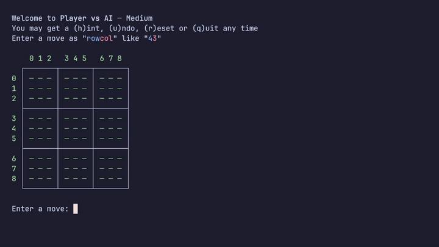
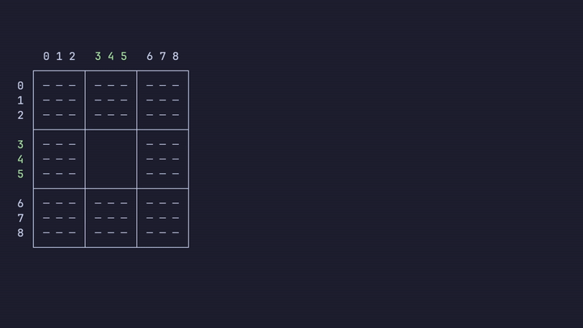

# UT3 Oxide

*you·tee·three ox·ide*

A performant command-line program to play *Ultimate* Tic Tac Toe featuring an
Alpha-Beta pruning AI, and local multiplayer.



## Description

UT3 Oxide is a command-line program in Rust for playing the Ultimate Tic Tac
Toe (UT3) against a bot or with another player locally. The AI uses Minimax
with [Alpha-Beta pruning](https://en.wikipedia.org/wiki/Alpha-beta_pruning)
(α-β). The engine uses bitpacking, bitwise operations, and domain-specific
optimisations for efficient storage, cache utilisation, and improved
performance.

## Motivation

UT3 Oxide improves upon the [prototype](https://utttai.netlify.app/) by having:

- Offline play:
  - With friends via local multiplayer
  - Against a bot with varying levels of difficulty
  - AI versus AI
- Clearer UI
- Substantial performance improvements

Additionally, the project enabled deepening my understanding of binary and
bitwise operations in a performance context

## Quick Start

To try it out, download a pre-compiled binary for
your system from the [releases](https://github.com/cifres/ut3-oxide/releases),
then run the following in a terminal:

```bash
./ut3_oxide pva
```

If you're on Linux, remember to make it executable first:

```bash
chmod +x ut3_oxide_x86_64.AppImage
```

`pva` is a *command* for the 'Player versus AI' mode. See other [commands](#usage).

## Building

> [!NOTE]
> [Rust](https://rust-lang.org/tools/install) must be installed and on `path`.
> [Git](https://git-scm.com/install) is standard, but you can
> download the source code manually from the [releases](https://github.com/cifres/ut3-oxide/releases).

```bash
# Clone or manually download from releases
git clone github.com/cifres/ut3-oxide

# Change directory and build
cd ut3-oxide
cargo build
```

### Benching

```bash
cargo bench --profile release
```

## Usage

### Summary

| Command | Meaning | Notes |
| --------------- | --------------- | ----- |
| `tutorial` | Guided interactive exploration of rules | Follow the tutorial then optionally play a practice match |
| `pvp` | Player vs. Player | `(u)ndo`, `(r)eset`, `(q)uit` available in match |
| `pva` | Player vs. AI | `(h)int`, `(u)ndo`, `(r)eset`, `(q)uit` available in match |
| `ava` | AI vs. AI | Reports the results at the end |
| `help` | Print the help message | Provides example usage of each command |

### Examples

> [!IMPORTANT]
> `Depth`'s *parity*, i.e. whether it is odd or even, affects the
> AI's play style! An odd parity results in slightly more
> optimistic/aggressive whereas an even parity considerate. This is partly due
> to the [*horizon effect*](https://en.wikipedia.org/wiki/Horizon_effect)
> where the AI stops evaluation a position when the next move flips the tables
unexpectedly.

```bash
# ./ut3_oxide pva [depth=5]
./ut3_oxide pva
./ut3_oxide pva 8
./ut3_oxide pva 4
```

Alternatively, you may pit two AIs against each other at specified search
depths. Both AIs look 5 moves ahead per turn, play 100 games total, and
report the results:

> [!NOTE]
> Delay is in *milliseconds* but will only be used if `show` is `1`.

```bash
# ./ut3_oxide <depth_ai_x> <depth_ai_o> <repetitions> [show=0] [delay=500]
$ ./ut3_oxide ava 5 5 100
wr @ depth 5 X: 53.00% (53/100)
wr @ depth 5 O: 39.00% (39/100)
        — total games: 100
        — average total turns: 52.50 of total 5250
        — draws: 8.00% (8/100)
```

AIs play move-by-move at depth `7` for `1` game, waiting `1` second (`1000ms`)
between turns:

```bash
./ut3_oxide ava 7 7 1 1 1000
```



## How to Play

The tutorial is a great place to practically understand the rules but here is
an overview:

```bash
./ut3_oxide tutorial
```

As with regular '[Tic Tac Toe](https://en.wikipedia.org/wiki/Tic-tac-toe)'[^1],
the goal is to win by making a 3-in-a-line. However, UT3 diverges with two key
elements:

1. Expanding the board from *3x3* to *9x9* thereby netting 81 squares and 9
   *miniboards*.

1. Miniboard-move sending: the previous move dictates which *miniboard* the
   next move can be played in. For example, playing in the *top-centre* cell of
any miniboard sends the opponent to the *top-centre* miniboard, thus *forcing*
the next move to be played there. *However*, if that *miniboard*
cannot be played in, because a player has won it or it's full, then they are
permitted to play in any other *valid* [^2] *miniboard*. Thus, in a sense, you
win by coercing your opponent into letting you win.

## Future Work

Future work may comprise of these enhancements:

- Online multiplayer
- UI upgrade
- Clearer user feedback; SFX and VFX

[^1]: Sometimes localised as 'Noughts and Crosses' or 'Xs and Os'.
[^2]: A *miniboard* that is not full nor has neither player won; a
    *contestable*  miniboard.
